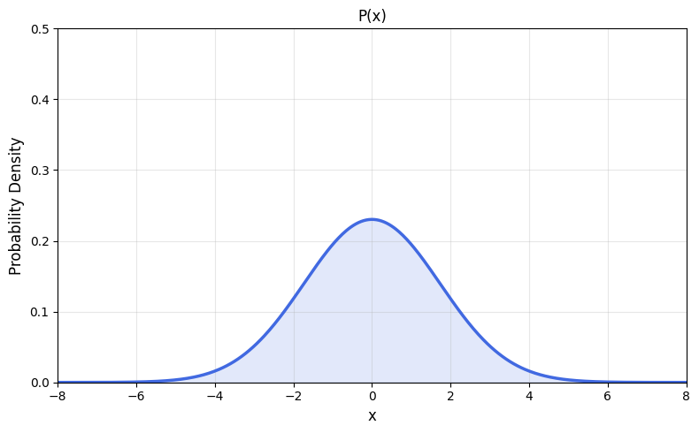
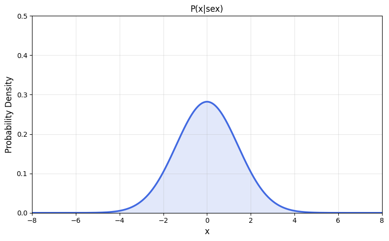
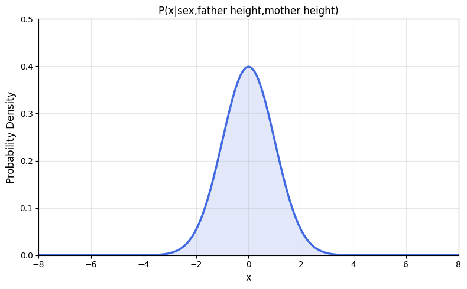
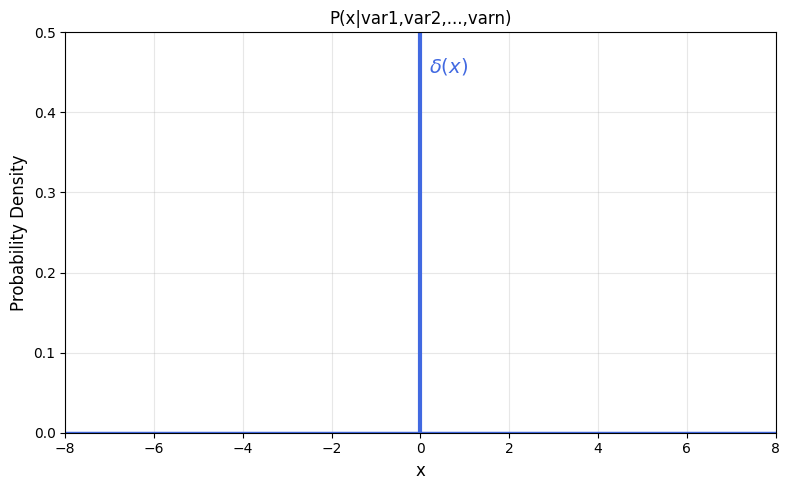

# Stochasticity, Determinism, and Reproducibility in Simulation

There are many forms of simulation in the computational community.  One useful way to divide them is into **stochastic** and **deterministic**: that is, given the same input, should the model always produce the same output?  In this short article, we discuss when stochasticity is *absolutely necessary* and when/how it may be eliminated in the name of **reproducibility**.

## Simulation
What is the point of a simulation? The goal of a simulation is to answer a question by constructing a model of the system under study. An ideal simulation should capture the *essential* mechanics relevant to the question at hand without containing extraneous computational or mathematical details. If we capture too few details then the simulation will provide misleading answers. On the other hand if we include too many we risk modelling components that have no impact upon the question being studied. The art of simulation is therefore to capture the essentials of the system, acknowledging that smaller effects will neglected but hoping that their omission will not too matter too much. In general, broader questions can be addressed with simpler, more abstract simulations, whereas specific or fine-grained questions typically require greater simulation detail.

A tempting question to ask is whether we could ever construct a simulation that perfectly predicts the future.

## Laplace’s Demon

> “We may regard the present state of the universe as the effect of its past and the cause of its future. An intellect which at a certain moment would know all forces that set nature in motion, and all positions of all items of which nature is composed, if this intellect were also vast enough to submit these data to analysis, it would embrace in a single formula the movements of the greatest bodies of the universe and those of the tiniest atom; for such an intellect nothing would be uncertain, and the future, just like the past, would be present before its eyes.”  
> — *Pierre-Simon Laplace, A Philosophical Essay on Probabilities* (1814)

In 1814, Pierre-Simon Laplace presented an argument for **causal determinism**.  
The passage above, later known as *Laplace’s Demon*, posits that if we knew all hidden variables with infinite precision and all relevant laws of nature, we could, in principle, predict all future states of the universe.

There are three main criticisms of this argument:

1. **Thermodynamic argument:** Many processes in nature are irreversible, meaning that previous states cannot be reconstructed from the current one. Laplace’s Demon appears to require universal reversibility.  
2. **Quantum mechanical argument:** Under some interpretations (but not all) of quantum mechanics, certain quantities are fundamentally stochastic.  
3. **Chaos theory argument:** Small changes in initial conditions can result in vastly different outcomes. The usual riposte is that an all-knowing demon *would* know all initial conditions with infinite precision, but in practice such precision is impossible.

## Satisfying the Demon - How to make a realistic deterministic simulation
With the arguments against Laplace’s Demon laid out, we can immediately identify some situations in which simulations **must** incorporate stochasticity:

1. **Quantum mechanical uncertainty.**  
   For example, in simulating radioactive decay, we may know the expected number of decay events per unit time but have no way of predicting which specific atoms will decay.  
2. **Irreversible thermodynamic processes.**  
   Many natural systems lose information about their microstates over time, making perfect reconstruction impossible.

With those out of the way let us consider the less clear cut cases. Recall our criteria for a fully deterministic simulation:

1. We must know all relevant hidden variables, and  
2. We must know them with infinite precision.

### Dealing with Hidden Variables

Let’s say we are trying to simulate the height of a human.  There is obviously a wide range of possible heights, and simply returning the average would make for a poor model.  We can start by assuming as little as possible and simulate from the distribution over all human heights:

This has a very large variance. It includes every age group, nationality, and genetic background.  An obvious improvement would be to specify the **sex** of the individual whose height we are trying to simulate. In probability, this is called *conditioning*: we change the model from  to :

This reduces the variance in outcomes because we have incorporated a known causal factor.  We can go further by adding additional inputs to our simulation (conditioning) for example, the heights of the parents:

There will still be variance in this outcome; siblings of the same sex can differ in height, but adding these variables further reduces the spread of possible outcomes. We can imagine continuing to condition on more relevant variables, each time shrinking the variance of the predictive distribution.  In the limit, if we could condition on *all* relevant variables and fully understood the mechanics governing them, the distribution of heights would collapse to a **delta function** (a spike with zero variance) assuming no quantum-mechanical or irreversible processes. The more variables we know and condition on, the more deterministic the simulation becomes.

In reality, this is rarely possible. We do not know all hidden variables, nor how they interact.  In such cases, one way to interpret the remaining randomness is as the result of **marginalisation over hidden causes**.  For example, if we cannot know the conditions in the womb precisely, we can represent their influence as a random draw from a distribution describing plausible womb conditions:

From an information theoretic POV each time we condition on an additional variable we reduce the **entropy** of our simulation outcomes. If \( X \) represents a simulated outcome (e.g. height) and \( Z \) represents all the variables we condition on (sex, parental height, etc.), then:

As we incorporate more relevant causal information, the conditional entropy \( H(X\mid Z) \) approaches zero, meaning that \( X \) becomes deterministic given \( Z \).  In the limit where all relevant variables are known and measured with infinite precision the predictive distribution again collapses to a delta:

Uncertainty dissapears when the state of the system and its laws are completely determined.

### The Resolution of Hidden Variables

As previously discussed, in some systems even a very small change in input can produce a very large change in output. If we could measure all variables with infinite precision (as Laplace’s demon could) then there would be no variance in the outcome. In reality, computers have finite memory and cannot represent variables with infinite precision, even if their true values are known.  Incorporating **stochasticity** can therefore serve as a principled way to marginalise over uncertainty in numerical precision.  On the other hand, if the variables being modelled are **integer-valued** or confined to a **small discrete space**, a deterministic simulation may be possible. 

## Answering question 1: When is determinism plausible?
A deterministic simulation is plausible only when:

1. All relevant hidden variables are known  
2. and measured with sufficient precision, and
3. The system itself is not inherently stochastic (e.g. quantum or thermodynamic processes).

In every other case, stochasticity serves as a principled way to represent our ignorance about the system’s unobserved states, interactions or limited numerical resolution.

## Answering question 2: When and how can realism/stochasity be traded for Reproducibility?

In regulated domains such as pensions, healthcare, or insurance, it is often necessary to **perfectly reproduce past results** for audit purposes, even when the underlying system is fundamentally stochastic. The challenge, therefore, is to design simulations that remain *principled* (accurately representing uncertainty) while being *bitwise identical* to the past.

There are several ways to trade off realism against reproducibility:

1. **Ask broader rather than narrower questions.**  
   Broad, coarse-grained questions can often be answered accurately with simpler simulations. Simpler simulations depend on fewer variables, making it feasible to condition on all of them — thus avoiding the need to marginalise over unknowns. This shifts the model closer to determinism without misrepresenting the underlying system.

2. **Frame questions around discrete or low-precision variables.**  
   If the conditioning variables are integers or limited to coarse precision, the system’s state space becomes small. That makes it practical to enumerate or fix all relevant states, producing deterministic outputs. For example, modelling yearly transitions between discrete health states is far easier to audit than modelling continuous variables such as blood pressure.

3. **Separate uncertainty from computation.**  
   When stochasticity is truly necessary, treat the *random seed* as an explicit input to the simulation. This preserves stochasticity whilst allowing exact reproducibility of specific runs.
